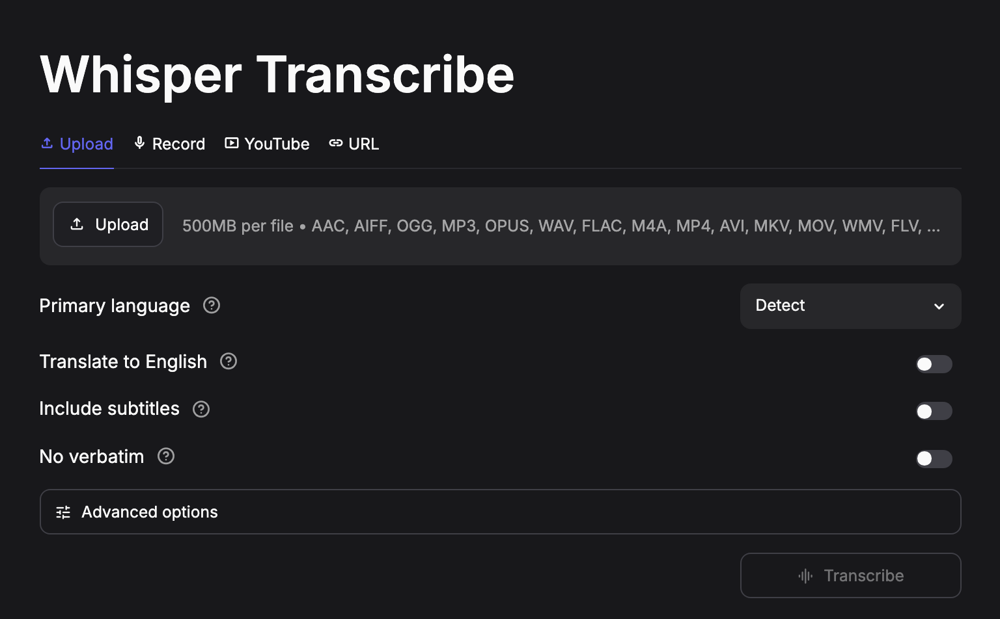

# Whisper Transcribe

[](https://github.com/darylalim/whisper-transcribe/actions/workflows/ci.yml)
[](LICENSE)
[](https://www.python.org/downloads/)

Transcribe and translate audio and video **locally on your Mac** — no cloud, no uploads, no cost. Powered by OpenAI's Whisper large-v3-turbo and accelerated on Apple Silicon with MLX (Apple's machine-learning framework). Bring your own files, record straight from the browser, or paste a YouTube or media URL.



## Features

- **[OpenAI Whisper large-v3-turbo](https://huggingface.co/mlx-community/whisper-large-v3-turbo)** via [mlx-whisper](https://pypi.org/project/mlx-whisper/), accelerated on Apple Silicon
- **On-device processing** — audio is transcribed entirely on your machine; nothing is uploaded (only the YouTube and URL input modes — plus the one-time model-weights download on first run — use the network)
- **100-language transcription** with auto-detect or manual selection
- **Translate non-English audio to English**
- **Four input modes** — multi-file upload (up to 500 MB per file), in-browser recording, YouTube links, and direct audio/video file URLs
- **Editable subtitle preview**, exportable as SRT (the standard subtitle file format)
- **No verbatim** — removes filler words, false starts, and repetitions
- **Decode segments independently** — more robust on noisy or music-heavy audio
- **Time-range clipping** — transcribe only selected portions (comma-separated `start,end` pairs in seconds)
- **Keyterms** — bias decoding toward proper nouns and jargon (up to 50 terms)
- **Instant repeat results** — identical file-and-settings combinations are served from cache
- **Light and dark theme** with Material Symbol icons, switchable in the app's settings menu

## How it works

You provide audio or video through one of four tabs (upload, record, YouTube, or URL). The app writes the audio to a temporary file and runs `mlx_whisper.transcribe()` with the Whisper large-v3-turbo model locally on Apple Silicon via MLX. The result is cached, rendered as editable plain text (or SRT when subtitles are enabled), and can be downloaded as `.txt` or `.srt`. See [CLAUDE.md](CLAUDE.md) for the full architecture.

## Requirements

- macOS on Apple Silicon (M1 / M2 / M3 / M4)
- Python 3.12+
- [FFmpeg](https://formulae.brew.sh/formula/ffmpeg)
- [uv](https://docs.astral.sh/uv/)

## Setup

```bash
git clone https://github.com/darylalim/whisper-transcribe.git
cd whisper-transcribe
brew install ffmpeg
uv sync
```

## Usage

```bash
uv run streamlit run streamlit_app.py
```

Upload one or more files (audio: `aac, aiff, ogg, mp3, opus, wav, flac, m4a`; video: `mp4, avi, mkv, mov, wmv, flv, webm, mpeg, 3gpp`), record audio in-browser, paste a YouTube URL, or paste an audio/video file URL, then click **Transcribe**.

> **First run:** the first time you transcribe, the Whisper large-v3-turbo weights (~1.5 GB) are downloaded from Hugging Face and cached locally, so the first transcription takes longer and needs an internet connection. Subsequent transcriptions run offline.

Optional controls:

- **Primary language** — auto-detected by default
- **Translate to English** — translate non-English audio
- **Include subtitles** — show an editable SRT subtitle preview; the **Download** button then serves a `.srt` file instead of `.txt`
- **No verbatim** — remove filler words, false starts, and repetitions
- **Decode segments independently** — disable prior-window context; more robust on noisy or music-heavy audio, at the cost of slightly choppier wording where 30 s windows meet
- **Time range** — transcribe only selected portions; comma-separated `start,end` pairs in seconds (e.g., `30,90` for one clip, `0,60,120,180` for multiple); invalid ranges are flagged inline
- **Keyterms** — bias decoding toward specific terms (proper nouns, jargon)

**Decode segments independently**, **Time range**, and **Keyterms** are grouped under an **Advanced options** expander.

## Development

After `uv sync`, the project's checks run through uv:

```bash
uv run pytest             # run the test suite
uv run ruff check .       # lint
uv run ruff format .      # format
uv run ty check           # type-check
```

CI runs these same checks on every push to `main` and on pull requests. The workflow targets a **macos-14 (Apple Silicon) runner**, since `mlx-whisper` ships no Linux wheels. Please make sure `ruff`, `ty`, and `pytest` pass before opening a pull request.

## Troubleshooting

- **`ffmpeg` not found** — install it with `brew install ffmpeg` and verify with `ffmpeg -version`. FFmpeg is required for decoding audio and video.
- **Intel Mac / non–Apple Silicon** — `mlx-whisper` requires Apple Silicon and will not run on Intel Macs.
- **Long pause on the first transcription** — the model weights (~1.5 GB) are downloading from Hugging Face (see the *First run* note above); this needs a network connection and only happens once.
- **YouTube download fails** — this usually means `yt-dlp` is out of date; update it with `uv lock --upgrade-package yt-dlp && uv sync`.
- **URL download rejected** — direct audio/video URLs are capped at 500 MB.

## License

This project is licensed under the [MIT License](LICENSE).
